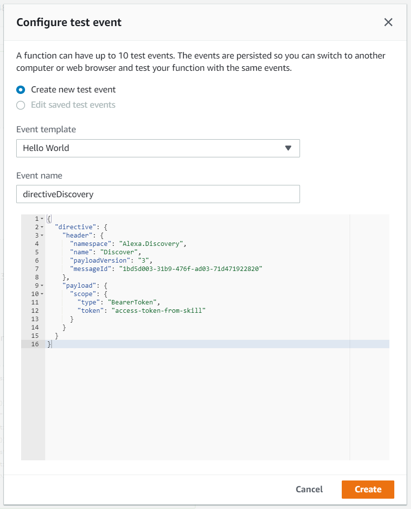
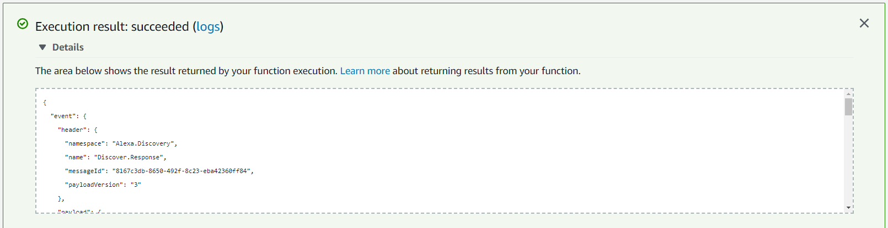

# Deploy the Sample Code

To deploy the sample code, it must first be packaged and then uploaded to the AWS Lambda as the function code.

## Package the Sample Code

1. In your working directory, browse to the *skill-sample-nodejs-smarthome-switch/lambda/smarthome* directory.
2. In that directory and from the command-line, run the following command to install the dependencies: `npm install`.
2. Zip the contents of the *skill-sample-nodejs-smarthome-switch/lambda/smarthome* directory into a file named `package.zip` and save it to the `working-smarthome` folder. Make sure that the index.js file, alexa/ folder, and node_modules/ folder are at the root of the zip file. Do not include the full `skill-sample-nodejs-smarthome-switch/lambda/smarthome` path structure.

If you encounter any issues, refer to the [AWS Documentation for Creating a Deployment Package (Node.js)](https://docs.aws.amazon.com/lambda/latest/dg/nodejs-create-deployment-pkg.html).

## Upload the Sample Code

1. Navigate to https://us-east-1.console.aws.amazon.com/lambda/home?region=us-east-1#/functions/skill-sample-nodejs-smarthome-switch?tab=graph and locate the *Function code* section.
2. In the code entry type dropdown, select **Upload a .ZIP file**.
3. Click the **Upload** button and browser to the `working-smarthome` directory or where you zipped the packaged code.
4. Select the `package.zip` file to upload as the lambda function code.
5. Click **Save** at the top right of the page. If successful, the environment of the *Function code* section will update replacing the previous contents.

## Test the Lambda Function
After the sample code is uploaded to the Lambda function, you can test that it is properly working via the **test events** functionality of the AWS Lambda console. This is done by creating a Test Event that contains a sample directive message that the function code should handle and respond to.

### Create a Discovery Test Event
1. On the function page for _skill-sample-nodejs-smarthome-switch_, select the **Select a test event..** dropdown from the top menu of the function and click **Configure test events**.
2. In the dialog that opens, leave **Create new test event** selected and leave the default template.
3. For the _Event name_ enter: `directiveDiscovery`.
4. Copy and paste the contents of https://raw.githubusercontent.com/alexa/alexa-smarthome/master/sample_messages/Discovery/Discovery.request.json into the text field at the bottom of the dialog replacing its contents.
5. Click **Create**.

### Run a Discovery Test Event
1. With the **directiveDiscovery** Test Event created and selected in the dropdown, click the **Test** button.
2. If everything was successful, an "Execution result: succeeded" message will be returned and clicking on the **Details** link of the result should show a response that looks like the following:

Any errors with the code or packaging and deployment of the code will be reflected in the result response. Not that on a successful response, the event namespace is `Alexa.Discovery`. This is because the code is responding to a test event that sends in a Discovery directive. 

Next [Test the Skill](test-the-skill.md)

Return to the [Instructions](README.md)