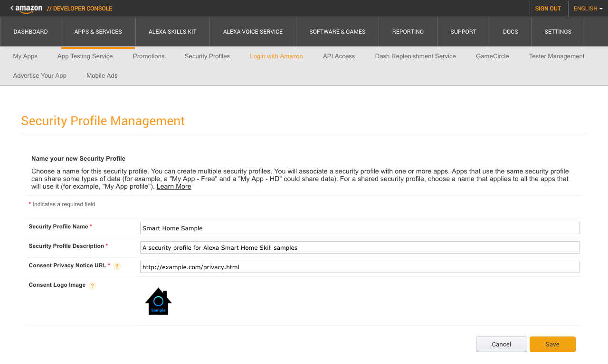

# Setup Login with Amazon

For the sample environment, a development Login with Amazon (LWA) security profile will be used for configuring Account Linking, which is required for a Smart Home Skill.

If you already have a valid `Smart Home Sample`  security profile created from a previous sample, you can reuse that profile and skip creating and configuring a new security profile.

## Create a Login with Amazon Security Profile

To facilitate account linking in the Smart Home sample code, a security profile is needed to generate a Client ID and Client Secret to use during the configuration of the Alexa skill.

1. In your web browser, go to https://developer.amazon.com/lwa/sp/overview.html.
2. On the *Login with Amazon* page, click the **Create a New Security Profile** button.
3. On the *Security Profile Management* page, enter `Smart Home Sample` for the Security Profile Name.
4. For the *Security Profile Description* enter `A security profile for Alexa Smart Home Skill samples`.
5. For the *Consent Privacy Notice URL* enter http://example.com/privacy.html for illustrative purposes or use your own if you already have a public consent privacy policy. For a production Smart Home Skill, a valid consent privacy notice will be required.
6. For the *Consent Logo Image* use the `alexa-sample-smarthome-150x.png` file in the */instructions/img* source folder or download https://raw.githubusercontent.com/alexa/skill-sample-nodejs-smarthome-switch/master/instructions/img/alexa-sample-smarthome-150x.png to your working directory and then click the Upload Image area to load the PNG file from where you saved it.
7. If your profile configuration looks like the following, click **Save** on the *Security Profile Management* page.



## Configure the Login with Amazon Security Profile

If creating the Login with Amazon Security Profile was successful, a message similar to 'Login with Amazon successfully enabled for Security Profile. Click (gear-icon) to manage Security Profile.' will be returned.

1. From the list of Security Profiles, click the Show Client ID and Client Secret link for the Sample Alexa Smart Home profile.
2. Copy the displayed Client ID and Client Secret values and save them to the `setup.txt` file in the `working-smarthome` directory replacing the format example entries for [Login with Amazon Client ID] and [Login with Amazon Client Secret] respectively.

```
[Login with Amazon Client ID]
amzn1.application-oa2-client.XXXXXXXXXXXXXXXXXXXXXXXXXXXXXXXX

[Login with Amazon Client Secret]
XXXXXXXXXXXXXXXXXXXXXXXXXXXXXXXXXXXXXXXXXXXXXXXXXXXXXXXXXXXXXXXX
```


Further configuration of the Security Profile Allowed Return URLs will be done during configuration of the Alexa Smart Home Skill Account Linking.

Next [Create the Skill](create-the-skill.md)

Return to the [Instructions](README.md)
