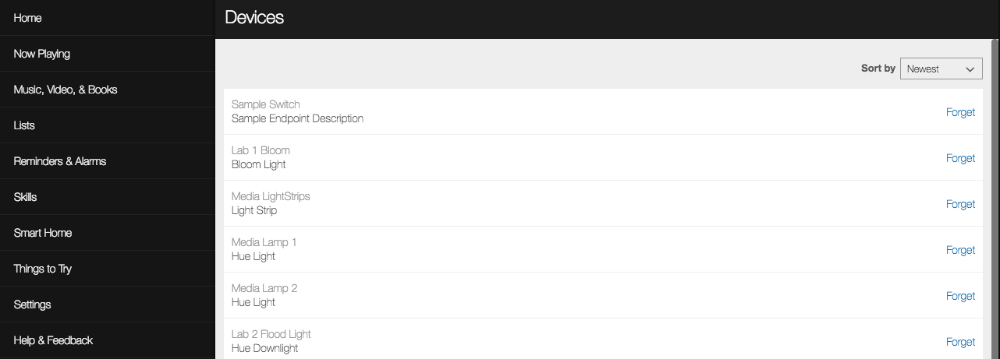

# Test the Skill

To test the smart home skill on a device, it must first be enabled and linked to your Amazon developer account.

## Link the Alexa Smart Home Skill

1. Go to [https://alexa.amazon.com](https://alexa.amazon.com/), login with your developer account, and select **Skills** from the left menu.
2. Click **Your Skills** from the top right of the section.
3. On the Your Skills page, select the *DEV SKILLS* tab.
4. Click the *skill-sample-nodejs-smarthome-switch* skill.
5. On the *skill-sample-nodejs-smarthome-switch* page, click **Enable** in the top right and authenticate with your Amazon developer account. If you are already signed in, you will be presented with a dialog asking to “Click 'Allow' to sign in to Smart Home Sample”.
6. On success, you should be presented with a window that reads “skill-sample-nodejs-smarthome-switch” has been successfully linked.
7. When redirected back to the Skill page, you will be prompted *Discover Devices*. Click **Discover Devices**.
8. After the discovery process completes, a new “Sample Switch” with the description of “Sample Endpoint Description” will be available in your *Devices* list.

## Test the Skill through the Alexa Developer Console

The Alexa Developer Console has test functionality built-in and can be used to test your skills under development.

1. Navigate to https://developer.amazon.com/alexa/console/ask and select skill-sample-nodejs-smarthome-switch from the list of *Alexa Skills*.
2. Select the *Test* tab.
3. In the *Alexa Simulator* tab, leave English selected and type `Alexa, turn on sample switch` into the input box.
4. If successful, Alexa should respond with `ok`.

## Test the Skill with an Alexa-Enabled Device

If you have an Amazon Echo or other Alexa-enabled device associated to your Amazon developer account, you can give that device the command “Alexa, turn on sample switch” and she should respond with “OK”.

Next [Review the Skill Logs](review-the-skill-logs.md)

Return to the [Instructions](README.md)